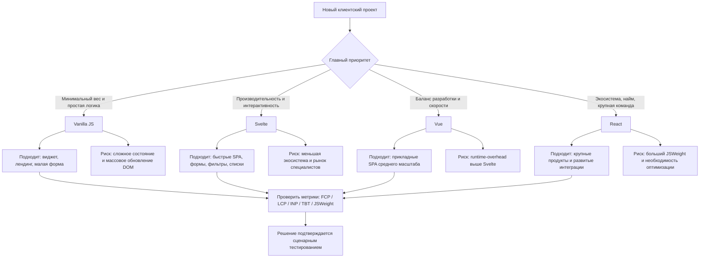

# Рекомендации по выбору клиентской технологии

Документ обобщает выводы экспериментального стенда, созданного для сравнения
четырех реализаций одного SPA-приложения: React, Vue, Svelte и Vanilla JS.
Основной акцент сделан на результатах текущей работы: одинаковые страницы
`Load`, `Filter`, `Form`, единые данные из `shared`, одинаковые сценарии
Playwright, единый механизм сбора метрик и контролируемая среда запуска.

Рекомендации не следует трактовать как универсальный рейтинг фреймворков.
Они применимы прежде всего к классу задач, близкому к эксперименту:
клиентские SPA-интерфейсы с начальной загрузкой, динамической фильтрацией
списка, формой, валидацией, зависимыми полями и измерением пользовательских
метрик производительности.

## 1. Основание для рекомендаций

В работе сравнивались не идентичные строки кода, а разные технологические
подходы к реализации одного пользовательского поведения. Сопоставимость
обеспечивалась следующими условиями:

- одинаковые пользовательские сценарии: `Load`, `Filter`, `Form`;
- одинаковые тестовые данные: товары, страны, города;
- общие функции фильтрации, сортировки, `debounce` и загрузки городов;
- общий модуль сбора метрик `shared/metrics.ts`;
- одинаковые селекторы `data-testid` для автотестов;
- одинаковые ограничения CPU и сети через Playwright/CDP;
- единый формат фиксации результатов в `metrics/metrics.csv`.

Файл `metrics/metrics.csv` в репозитории может отражать текущий или
демонстрационный набор прогонов. Для финальных выводов ВКР рекомендации должны
опираться на сводные показатели полной серии измерений: p50, p95 и коэффициент
вариации. Если используется только текущий CSV-файл с малым числом повторов,
выводы следует трактовать как ориентировочные, а не как статистически
устойчивое ранжирование.

## 2. Краткий итог по результатам стенда

Сводные показатели полной серии прогонов показывают разные профили поведения
технологий. Для текущего CSV-файла эти профили следует рассматривать как
ориентировочные наблюдения, подтверждающие общую логику эксперимента.

| Технология | Сильная сторона в эксперименте | Слабая сторона в эксперименте |
|---|---|---|
| Vanilla JS | минимальный `JSWeight`, быстрый `FCP` и хороший `LCP` на простых сценариях | резкий рост `TBT` и `LongTasks` на динамическом сценарии `Filter` |
| Svelte | выгодный баланс веса, интерактивности и малых блокирующих задач | меньшая распространенность экосистемы по сравнению с React/Vue |
| Vue | стабильный компромисс между производительностью, удобством разработки и управляемостью состояния | небольшой runtime-overhead относительно Svelte и Vanilla JS |
| React | самая развитая экосистема и высокая пригодность для крупных продуктов | наибольший `JSWeight` и более высокая стоимость обновлений в данном стенде |

Ключевой вывод исследования:

> Архитектура клиентской технологии влияет не только на скорость начальной
> загрузки, но и на распределение вычислительной нагрузки в основном потоке
> браузера при пользовательском взаимодействии.

## 3. Как архитектура влияет на метрики

Различия между технологиями проявляются в том, где именно каждая архитектура
несет основную вычислительную стоимость: на этапе загрузки JavaScript, при
инициализации приложения, при обновлении DOM или при обработке пользовательского
ввода.

### Vanilla JS

Vanilla JS не содержит фреймворкового runtime, слоя реактивности и механизма
сравнения виртуального дерева. Поэтому в стенде он показывает минимальный
`JSWeight` и быстрый `FCP` на простых сценариях. Браузер получает меньше
служебного JavaScript-кода, быстрее начинает отрисовку и раньше показывает
первый контент.

Но это преимущество не означает автоматическую победу по интерактивности. В
динамическом сценарии `Filter` Vanilla-реализация вручную пересобирает разметку
списка. Такая модель может создавать длинные синхронные задачи в основном потоке
и повышать `TBT`/`LongTasks`. Поэтому Vanilla JS хорошо выглядит как легкий
baseline, но при росте состояния и частых обновлениях требует ручных
оптимизаций: точечного обновления DOM, виртуализации списков и батчинга.

### Svelte

Svelte переносит значительную часть работы на этап компиляции. В браузере
остается меньше служебного runtime-кода, а обновления интерфейса выполняются
более прямыми инструкциями. В рамках стенда это объясняет выгодный профиль по
весу JavaScript, интерактивности и блокирующим задачам.

Практический смысл результата: Svelte рационален там, где важны малый бандл,
низкая runtime-стоимость и предсказуемая отзывчивость на типовых сценариях
работы со списками и формами. Ограничение состоит не в производительности, а в
организационных факторах: экосистема и рынок специалистов меньше, чем у React.

### Vue

Vue использует runtime-реактивность и шаблонную модель. Состояние отслеживается
через реактивную систему, а изменения интерфейса применяются достаточно
адресно. Это создает runtime-overhead относительно Svelte и Vanilla JS, но
снижает риск неэффективного ручного управления DOM.

В стенде Vue занимает компромиссную позицию: он не является самым легким по
`JSWeight`, но сохраняет стабильный профиль в сценариях формы и фильтрации.
Поэтому Vue можно рассматривать как практичный вариант, когда важны не только
метрики, но и читаемость компонентов, предсказуемость разработки и умеренная
стоимость поддержки.

### React

React строит интерфейс через компонентное дерево и runtime-реконсиляцию. Такая
модель дает универсальность и зрелую экосистему, но добавляет служебную работу:
нужно загрузить больший объем JavaScript, выполнить логику компонентов и
рассчитать изменения интерфейса перед применением их к DOM.

В рамках стенда это связано с большим `JSWeight` и более выраженной стоимостью
обновлений на сценарии `Filter`. Этот результат не означает, что React
некорректен для производительных приложений. Он означает, что React чаще требует
дополнительной инженерной оптимизации: разделения кода, виртуализации списков,
контроля лишних ререндеров и профилирования узких мест.

### Обобщение

Полученные различия объясняются не только тем, "какой фреймворк быстрее", а тем,
как каждая технология распределяет работу между этапами сборки и выполнения:

- Vanilla JS минимизирует стартовый runtime, но перекладывает эффективность
  обновления DOM на разработчика;
- Svelte снижает runtime-стоимость за счет компиляции;
- Vue балансирует между реактивностью, читаемостью и умеренным overhead;
- React платит большим runtime-слоем за универсальную модель разработки и
  зрелую экосистему.

## 4. Рекомендация по умолчанию

Если выбирать технологию именно по результатам данного исследования, без учета
внешних организационных факторов, наиболее выгодный технический профиль в рамках
стенда показывает Svelte. Более осторожная практическая рекомендация для SPA,
близких к экспериментальным сценариям, - рассматривать Svelte и Vue как два
основных варианта.

Причина: в текущем стенде Svelte сочетает небольшой вес JavaScript, быстрые
показатели загрузки и низкую стоимость интерактивных обновлений. Vue при этом
сохраняет более осторожный баланс между производительностью, читаемостью кода и
зрелостью экосистемы. Архитектурно преимущество Svelte объясняется
компиляционным подходом: значительная часть работы переносится на этап сборки,
а в браузере выполняется более прямой код обновления DOM.

Однако практический выбор не должен опираться только на метрики. Для реального
проекта нужно учитывать размер команды, зрелость экосистемы, требования к
поддержке, доступность специалистов, наличие UI-библиотек и долгосрочные риски.

## 5. Когда выбирать Svelte

Svelte рационально выбирать, если приоритетом являются скорость загрузки,
отзывчивость интерфейса и малый объем клиентского JavaScript.

### Когда Svelte подходит лучше всего

- интерфейс должен быстро загружаться на слабых устройствах;
- приложение содержит динамические списки, фильтрацию, формы и частые изменения
  состояния;
- важны низкие `TBT`, `INP` и небольшое количество длинных задач;
- проект не требует очень большой корпоративной экосистемы;
- команда готова использовать менее массовый, но технически эффективный стек.

### Плюсы Svelte

- низкая runtime-нагрузка за счет компиляции компонентов;
- хороший профиль интерактивности в сценарии `Filter`;
- меньший JavaScript-бандл по сравнению с React и Vue в данном стенде;
- простая модель описания компонентов;
- низкая стоимость обновления интерфейса при умеренной сложности приложения.

### Минусы Svelte

- экосистема и рынок специалистов меньше, чем у React;
- меньше готовых корпоративных решений и UI-компонентов;
- при росте проекта требуется дисциплина в архитектуре, так как выбор
  стандартных решений менее очевиден;
- некоторые команды могут столкнуться с организационным риском внедрения менее
  распространенной технологии.

### Вывод по Svelte

Svelte рекомендуется для проектов, где производительность клиентского интерфейса
является одним из основных критериев выбора, а команда может принять стек с
меньшей, но достаточно зрелой экосистемой.

## 6. Когда выбирать Vue

Vue рационально выбирать, если нужен баланс между производительностью,
понятностью разработки и устойчивой архитектурой приложения.

### Когда Vue подходит лучше всего

- требуется быстрый старт разработки;
- важна читаемость структуры компонентов;
- приложение содержит формы, фильтры, списки и умеренно сложное состояние;
- команда хочет получить хорошую производительность без агрессивной ручной
  оптимизации;
- нужен компромисс между Svelte-подходом и React-экосистемой.

### Плюсы Vue

- реактивная модель хорошо подходит для форм и динамических интерфейсов;
- шаблонный синтаксис делает структуру UI явно читаемой;
- производительность в стенде выглядит сбалансированной;
- runtime-overhead умеренный;
- экосистема достаточно зрелая для большинства прикладных задач.

### Минусы Vue

- JavaScript-бандл больше, чем у Svelte и Vanilla JS в данном эксперименте;
- архитектурные возможности шире, чем требуется для простых интерфейсов;
- в крупных проектах качество результата сильно зависит от выбранной структуры
  состояния и соглашений команды;
- по рынку и количеству готовых enterprise-решений Vue обычно уступает React.

### Вывод по Vue

Vue рекомендуется как практичный выбор для прикладных SPA-интерфейсов среднего
масштаба, где важны управляемость кода, предсказуемая реактивность и достаточно
хорошая производительность без высокой стоимости входа.

## 7. Когда выбирать React

React рационально выбирать, если главным фактором является не минимальная
стоимость исполнения, а зрелость экосистемы, масштабируемость команды и
доступность готовых решений.

### Когда React подходит лучше всего

- проект крупный и долгоживущий;
- важны готовые UI-библиотеки, интеграции и инструменты;
- команда уже имеет опыт React;
- требуется проще нанимать разработчиков;
- проект может позволить дополнительную оптимизацию производительности:
  code splitting, virtualization, lazy loading, оптимизацию ререндеров.

### Плюсы React

- крупнейшая экосистема среди рассматриваемых решений;
- большое количество готовых библиотек и паттернов;
- высокая переносимость опыта между проектами;
- развитые инструменты тестирования, профилирования и разработки;
- подходит для сложных продуктовых интерфейсов и крупных команд.

### Минусы React

- самый большой `JSWeight` в текущем стенде;
- более высокая стоимость обновления интерфейса на сценарии `Filter`;
- runtime-реконсиляция и компонентное дерево добавляют вычислительные расходы;
- для хорошей производительности часто нужны дополнительные инженерные решения;
- в простом или среднем приложении React может быть избыточным по накладным
  расходам.

### Вывод по React

React рекомендуется для крупных проектов, где экосистема, найм, поддержка и
интеграции важнее минимального веса и минимальной runtime-стоимости. Если
главный критерий - производительность на слабых устройствах, React требует
более тщательной оптимизации.

## 8. Когда выбирать Vanilla JS

Vanilla JS в рамках исследования корректнее рассматривать как нативную
контрольную реализацию без фреймворкового runtime, а не как прямую замену
React, Vue или Svelte для любого SPA-проекта.

### Когда Vanilla JS подходит лучше всего

- очень простой интерфейс;
- лендинг, виджет, микроприложение или небольшая форма;
- минимальный вес JavaScript критичен;
- логика обновления DOM проста и редко меняется;
- проект не требует масштабной поддержки и роста функциональности.

### Плюсы Vanilla JS

- минимальный runtime-overhead;
- самый маленький `JSWeight` в текущем стенде;
- быстрый `FCP` на простых сценариях;
- полный контроль над DOM и событиями;
- отсутствие зависимости от фреймворковой экосистемы.

### Минусы Vanilla JS

- ручное управление DOM быстро усложняет код;
- легко получить длинные синхронные операции при массовой перерисовке;
- в текущем стенде сценарий `Filter` показал высокий `TBT` и большую сумму
  `LongTasks`;
- сложнее поддерживать единообразную архитектуру при росте приложения;
- разработчик самостоятельно отвечает за инкрементальные обновления,
  очистку обработчиков, управление состоянием и предотвращение лишнего рендера.

### Вывод по Vanilla JS

Vanilla JS рекомендуется для небольших интерфейсов и как контрольная точка для
оценки накладных расходов фреймворков. Для динамического SPA с растущим
состоянием и списками Vanilla JS без дополнительных архитектурных приемов
становится рискованным выбором.

## 9. Выбор по типу задачи

| Тип проекта | Предпочтительный выбор | Обоснование |
|---|---|---|
| Минимальный виджет или простая форма | Vanilla JS | минимальный вес, отсутствие runtime |
| Небольшое производительное SPA | Svelte или Vue | низкий overhead, хорошая интерактивность и приемлемая поддерживаемость |
| Прикладное SPA среднего масштаба | Vue или Svelte | баланс производительности и поддержки |
| Форма + фильтрация + динамический список | Svelte или Vue | эффективная реактивность и умеренная стоимость обновлений |
| Крупный продукт с большой командой | React | экосистема, найм, библиотеки, зрелые практики |
| Интерфейс для слабых устройств | Svelte, затем Vue | меньшая нагрузка на JS и основной поток |
| Проект с максимальным числом готовых интеграций | React | самая развитая экосистема |
| Исследовательский baseline | Vanilla JS | контрольная реализация без фреймворкового runtime |

## 10. Выбор по приоритетной метрике

| Приоритет | Рекомендуемая технология | Комментарий |
|---|---|---|
| Минимальный `JSWeight` | Vanilla JS | лучший вес, но не гарантирует лучшую интерактивность |
| Лучший общий технический профиль в стенде | Svelte | сильный профиль в загрузке и интерактивности |
| Стабильная разработка без сильного overhead | Vue | компромисс между удобством и производительностью |
| Минимизация `TBT` и `LongTasks` | Svelte или Vue | выбирать по минимальным p50/p95 в сценарии `Filter` для конкретной серии прогонов |
| Большая экосистема и долгосрочная поддержка | React | технически тяжелее, но организационно сильнее |
| Простота маленького решения | Vanilla JS | оправдано только при малой сложности состояния |

## 11. Практические рекомендации по оптимизации

### Для React

- использовать разделение кода и ленивую загрузку маршрутов;
- применять виртуализацию списков при большом числе элементов;
- контролировать лишние ререндеры компонентов;
- выносить тяжелые вычисления из синхронного обработчика пользовательского
  ввода;
- отдельно профилировать сценарии фильтрации и массового обновления DOM.

### Для Vue

- следить за размером реактивного состояния;
- избегать лишних глубоких реактивных структур;
- использовать вычисляемые значения для производных данных;
- применять виртуализацию списков при росте количества элементов;
- сохранять единые соглашения по структуре компонентов.

### Для Svelte

- контролировать размер скомпилированного кода при росте проекта;
- не переносить слишком много логики непосредственно в компоненты;
- использовать сторы и модульную структуру для сложного состояния;
- профилировать большие списки, несмотря на низкий runtime-overhead;
- избегать ненужных глобальных зависимостей.

### Для Vanilla JS

- не пересобирать крупные DOM-фрагменты целиком при каждом изменении;
- применять точечное обновление узлов вместо полного `innerHTML`;
- использовать `DocumentFragment`, батчинг и виртуализацию списков;
- явно очищать обработчики событий при размонтировании экранов;
- выносить управление состоянием в отдельный слой, если приложение растет.

## 12. Итоговая позиция исследования

На основании проведенного эксперимента нельзя утверждать, что один фреймворк
абсолютно лучше другого во всех условиях. Корректный вывод состоит в том, что
каждая архитектура формирует свой профиль затрат:

- Vanilla JS минимизирует стартовый runtime, но требует ручного контроля
  обновлений DOM;
- Svelte снижает runtime-стоимость за счет компиляции;
- Vue предлагает сбалансированную реактивную модель;
- React платит большим объемом JavaScript и runtime-работой за мощную экосистему
  и универсальную модель разработки.

Для сценариев, близких к экспериментальному стенду, технически рациональными
вариантами являются Svelte и Vue. Svelte показывает преимущество при приоритете
малого JavaScript-бандла и низкой runtime-стоимости. Vue сохраняет
сбалансированный профиль между производительностью, читаемостью кода и
зрелостью экосистемы. React оправдан в крупных продуктах, где критичны рынок
специалистов, интеграции и долгосрочная поддержка. Vanilla JS целесообразно
рассматривать как baseline или решение для малых интерфейсов, но не как основной
выбор для динамического SPA с растущим состоянием.

## 13. Использованные внешние ориентиры

Внешние источники использованы только для подтверждения общих архитектурных
характеристик технологий и метрик:

- React: официальная документация описывает модель рендера и commit-этапа
  компонентного дерева: https://react.dev/learn/render-and-commit
- Vue: официальная документация описывает runtime-реактивность, отслеживание
  зависимостей и обновление эффектов: https://vuejs.org/guide/extras/reactivity-in-depth.html
- Svelte: официальная документация описывает Svelte как компилируемый подход к
  построению UI: https://svelte.dev/docs
- Web Vitals: официальный набор пользовательских метрик для оценки качества
  интерфейса: https://web.dev/articles/vitals

## 14. Рекомендательная схема

